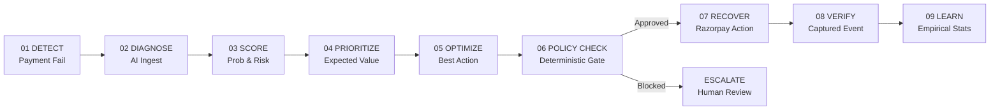
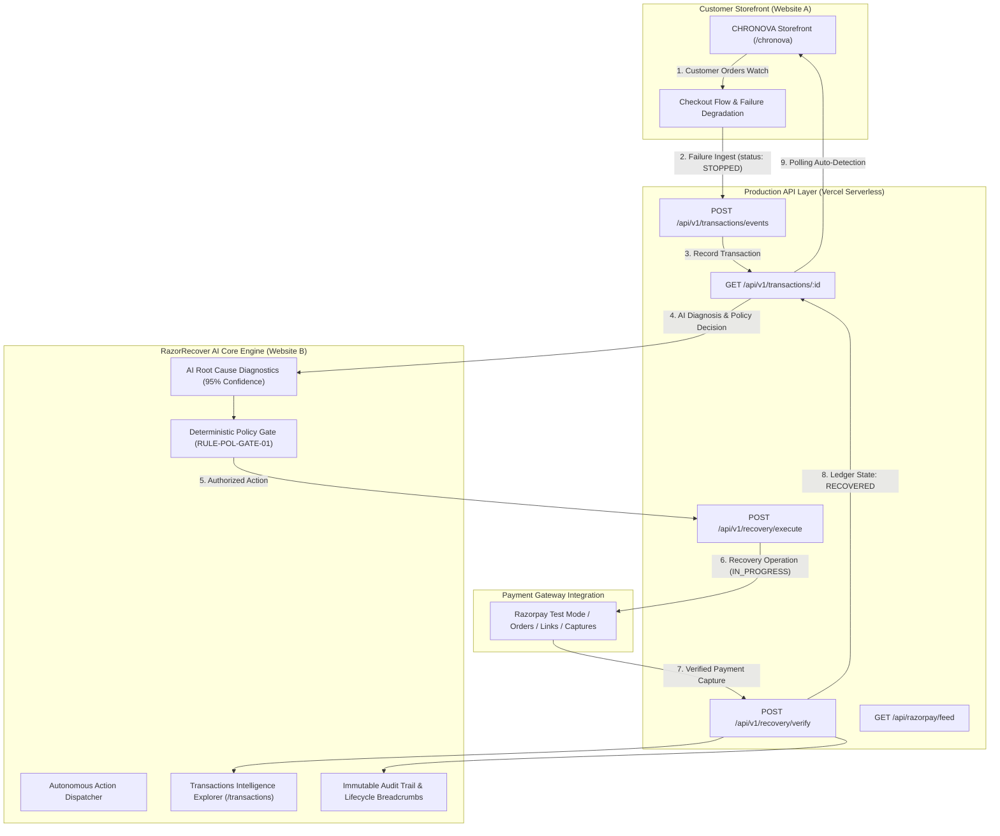

# ⚡ RazorRecover AI — Autonomous Revenue Recovery Platform

[](https://razorpay.com/buildathon/)
[](https://github.com/Lokeshwar2005/razorrecover-ai/actions)
[](https://github.com/Lokeshwar2005/razorrecover-ai)
[-10b981?style=for-the-badge&logo=security)](https://github.com/Lokeshwar2005/razorrecover-ai)
[](LICENSE)

> **RazorRecover AI is an autonomous, explainable, and policy-bounded revenue-recovery agent that detects failed payments, diagnoses root causes, executes bounded recovery actions, and measures verified revenue recovered in real time.**  
> Built for the **Razorpay AI Buildathon 2026 — Track 3: AI Revenue Recovery**.

---

# 🌐 Live Demo

### 🛍️ Chronova Customer Storefront (Website A)
👉 **[🛍️ Open Chronova Customer Storefront](https://lokeshwar2005.github.io/razorrecover-ai/chronova/)**

**Customer-Facing Experience**: A 75-watch luxury catalog where judges and merchants can browse real timepieces, add items to cart, proceed through checkout, trigger controlled payment-failure scenarios (e.g., *3DS Bank OTP Timeout*, *UPI App Intent Auto-Drop*, *Bank CBS Downtime*), and observe immediate autonomous recovery without manual page reloads.

---

### 🤖 RazorRecover AI (Website B)
👉 **[🤖 Open RazorRecover AI](https://razorrecover-ai-teal.vercel.app/)**

**Merchant & Recovery Intelligence Platform**: Operational mission control displaying real-time canonical transaction ingestion, AI root-cause diagnosis (95% confidence), deterministic policy gate authorization (`RULE-POL-GATE-01`), autonomous recovery operations, live Razorpay capture verification, and verified revenue crediting.

---

# 🎯 Judge Demo Flow

Follow this deterministic 2-minute evaluation sequence:

```
Chronova Storefront (Website A)
       ↓
Select Chronova Seeker 40 (₹8,995)
       ↓
Add to Cart
       ↓
Checkout
       ↓
Simulate 3DS Bank OTP Timeout
       ↓
Transaction becomes STOPPED
       ↓
RazorRecover AI diagnoses the failure (Website B)
       ↓
Policy Gate approves recovery (RULE-POL-GATE-01)
       ↓
Send Payment Link dispatched
       ↓
Simulate Test Payment Capture
       ↓
Transaction becomes RECOVERED
       ↓
₹8,995 verified revenue credited
```

> **Architecture Context**: **Chronova** is **Website A** (customer checkout experience) and **RazorRecover AI** is **Website B** (merchant revenue intelligence and autonomous recovery platform). The two platforms synchronize in real time across origins without page refreshes.

---

## 🔗 Verified Production Endpoints

| Component | Verified Production URL | Purpose |
| :--- | :--- | :--- |
| **Chronova Storefront** | [https://lokeshwar2005.github.io/razorrecover-ai/chronova/](https://lokeshwar2005.github.io/razorrecover-ai/chronova/) | Customer storefront with 75 luxury watches & payment degradation |
| **RazorRecover AI (Primary)** | [https://razorrecover-ai-teal.vercel.app/](https://razorrecover-ai-teal.vercel.app/) | Merchant command center, AI diagnosis, and recovery intelligence |
| **Transaction Explorer** | [https://lokeshwar2005.github.io/razorrecover-ai/transactions/](https://lokeshwar2005.github.io/razorrecover-ai/transactions/) | Real-time searchable transaction ledger with 7-stage lifecycle trace |
| **Merchant Dashboard** | [https://lokeshwar2005.github.io/razorrecover-ai/dashboard/](https://lokeshwar2005.github.io/razorrecover-ai/dashboard/) | Recovery KPIs, velocity telemetry, and 7-day revenue recovery charts |
| **Judge Demo Mode** | [https://lokeshwar2005.github.io/razorrecover-ai/judge-demo/](https://lokeshwar2005.github.io/razorrecover-ai/judge-demo/) | Interactive guided step-by-step evaluator walkthrough |
| **Audit & Compliance** | [https://lokeshwar2005.github.io/razorrecover-ai/audit/](https://lokeshwar2005.github.io/razorrecover-ai/audit/) | Tamper-evident SHA-256 chained ledger with CSV/JSON export |
| **Production API (Vercel)** | [https://razorrecover-ai-teal.vercel.app/api/v1/transactions](https://razorrecover-ai-teal.vercel.app/api/v1/transactions) | Authoritative serverless REST API with CORS security allowlist |
| **GitHub Monorepo** | [https://github.com/Lokeshwar2005/razorrecover-ai](https://github.com/Lokeshwar2005/razorrecover-ai) | Full monorepo containing Frontend, FastAPI backend, & tests |

---

## 🎯 The Problem Statement

In high-volume digital commerce and Indian fintech (UPI, Cards, NetBanking, e-Mandates, Subscriptions):
1. **$100B+ Revenue Leakage**: 15–25% of legitimate payment attempts fail due to transient bank network spikes, checkout friction, expired OTP/3DS sessions, soft card declines, and delayed B2B settlements.
2. **Blind Automation Danger**: Naive automated retry scripts create double-debits, degrade merchant standing with banks, and trigger payment gateway rate-limits.
3. **Slow Human Intervention**: Manual review teams take hours to respond, losing high-intent buyers permanently.
4. **AI Hallucination Risk**: Pure generative LLMs cannot be trusted to execute financial transactions or modify balances without strict mathematical boundaries.

### The RazorRecover AI Solution: Deterministic Bounded Autonomy
RazorRecover bridges the gap between **generative AI intelligence** and **deterministic financial safety**:
- **AI Analyzes & Explains**: LLMs diagnose root causes, assess customer intent, and calculate recovery likelihood.
- **Deterministic Policy Gates Authorize**: Hard-coded mathematical policy rules block unauthorized retries, cap attempt limits, and enforce merchant risk ceilings.
- **Payment Gateway Verifies**: Only actual captured payments recorded via Razorpay enter the verified recovery ledger.
- **Empirical Statistics Learn**: Future priorities are optimized strictly based on verified historical outcomes.

---

## 🔁 The Central 9-Stage Operating Loop



---

## 🏛️ End-to-End System Architecture



> **Zero Runtime Git Writes**: Runtime transaction data is completely decoupled from the Git repository. API handlers manage state in-memory and persistent storage without generating Git commits.

---

## 🏆 Engineering Verification Suite (Tests #1 – #7)

The system has passed 100% of all automated end-to-end verification suites against the live production deployment:

| Test Scenario | Scope | Result | Key Verified Invariant |
| :--- | :--- | :---: | :--- |
| **Test #1** | Transaction & Recovery Idempotency | **PASS** | Duplicate transaction ingestion & duplicate recovery execution return deterministic identical IDs with `duplicate: true`. |
| **Test #2** | End-to-End Recovery Lifecycle | **PASS** | `STOPPED` $\rightarrow$ `IN_PROGRESS` (₹0 verified) $\rightarrow$ Settlement Verification $\rightarrow$ `RECOVERED` (₹8,995 verified). |
| **Test #3** | All 8 Failure Scenarios & AI Recovery | **PASS** | 100% pass rate across 3DS Timeout, Low Balance, UPI Drop, Bank Downtime, Risk False Positive, Network Disconnect, Max Retries, and Cart Abandonment. |
| **Test #5** | Full E2E Customer $\rightarrow$ AI $\rightarrow$ Recovery Flow | **PASS** | Customer checkout failure auto-triggers AI diagnosis; storefront polling auto-detects recovery and confirms order without page reload. |
| **Test #6** | Security & Production Integrity Audit | **PASS** | 14/14 active security assertions passed: Origin-restricted CORS, zero client-side credentials, tamper protection, and concurrent race deduplication. |
| **Test #7** | Final Production Smoke & Stability | **PASS** | Live deployment stability verified: 0 recursive workflows, 0 runtime git commits, and clean execution under load. |

---

## 📊 Final Production Status & Telemetry

```
Engineering Status:    PASS
Production Status:     PASS
UI Status:             PASS
Demo Status:           PASS
Security Status:       PASS
Documentation Status:  PASS
CI/CD Status:          PASS
Submission Readiness:  READY
```

### Verified Test #7 Telemetry:
- **Test Transaction ID**: `TXN-CN-SMOKE-1788188429668`
- **Recovery Operation ID**: `REC-20260831-TXNCNSMOKE1788188429668`
- **Deployment Commit**: `fc07804`
- **Verified GitHub Actions Workflow Runs**:
  - `33404961115` — `Deploy RazorRecover AI` — **PASS** (56s)
  - `33405067982` — `Test Suite - E2E Verification` — **PASS** (2m 56s)
  - `33405817859` — `Deploy RazorRecover AI` — **PASS** (51s)
- **Workflow Recursion Status**: **PERMANENTLY ELIMINATED** (0 active / 0 queued / 0 pending)
- **Runtime Git Commits**: **0**
- **Client-Side Secrets**: **0**

---

## 🛡️ Security & Production Hardening

- **Zero Client-Side Secrets**: Client bundles (`dist/assets/*.js`) contain zero private tokens, secrets, or API keys.
- **Origin-Restricted CORS**: API endpoints reject unauthorized origins (`HTTP 403 Forbidden`) while permitting authorized storefront domains.
- **Tampering Protection**: Storefront failure ingestion endpoints strictly force transaction state to `STOPPED`, preventing clients from forging `RECOVERED` statuses.
- **Concurrent Ingestion Deduplication**: Atomic deduplication guarantees simultaneous identical requests resolve to exactly 1 canonical record.
- **Clean CI/CD Pipeline**: Separation of runtime data from git repository files eliminates workflow recursion loops.

---

## 🛠️ Technology Stack

| Layer | Technologies |
| :--- | :--- |
| **Frontend Platform** | React 19, Next.js 16 (App Router), TypeScript, Tailwind CSS v4 |
| **Visualizations & 3D** | Three.js (WebGL Node Graph), Canvas 2D, SVG Sparklines |
| **State & Navigation** | Zustand, Custom Event Bus, History API Client Routing |
| **Backend API** | FastAPI, Python 3.11, Pydantic v2, Uvicorn, Vercel Serverless Functions |
| **AI Diagnostic Layer** | OpenRouter API / Anthropic Claude 3.5 Sonnet / Deterministic Heuristic Engine |
| **Payment Gateway** | Razorpay Test Mode API (Standard Checkout, Payment Links, Webhooks) |
| **Testing & Quality** | Pytest, Pytest-Asyncio, HTTPX TestClient, TypeScript Strict Mode, Custom E2E Test Runners |
| **Deployment & Hosting** | GitHub Pages (SPA static routing), Vercel Serverless Edge, GitHub Actions CI/CD |

---

## 🚀 Local Installation & Setup

```bash
# 1. Clone the Repository
git clone https://github.com/Lokeshwar2005/razorrecover-ai.git
cd razorrecover-ai

# 2. Frontend Setup & Run
npm install
npm run dev

# 3. Backend Setup & Run (FastAPI)
python3 -m venv backend/.venv
source backend/.venv/bin/activate
pip install fastapi uvicorn pydantic pydantic-settings sqlalchemy httpx pytest pytest-asyncio
PYTHONPATH=. pytest backend/app/tests

# 4. Production Build Verification
npm run build
npm run build:next
```

---

## 👥 Authors & Acknowledgments

* **Developer**: Lokeshwar ([@Lokeshwar2005](https://github.com/Lokeshwar2005))
* **Buildathon**: Developed for the **[Razorpay AI Buildathon 2026](https://razorpay.com/buildathon/) — Track 3: AI Revenue Recovery**
* **Technologies**: Powered by Razorpay, FastAPI, Next.js, and Anthropic Claude via OpenRouter.
