# ⚡ RazorRecover AI — Autonomous Revenue Recovery Platform

[](https://razorpay.com/buildathon/)
[-10b981?style=for-the-badge&logo=githubactions)](https://github.com/Lokeshwar2005/razorrecover-ai/actions)
[](https://github.com/Lokeshwar2005/razorrecover-ai)
[](LICENSE)

> **Autonomous, explainable, and bounded revenue recovery intelligence for merchants and digital businesses.**  
> Built for the **Razorpay AI Buildathon 2026 — Track 3: AI Revenue Recovery**.

---

## 🌐 Live Production Deployments

| Component | Endpoint / URL | Description |
| :--- | :--- | :--- |
| **Live Web Platform** | [https://lokeshwar2005.github.io/razorrecover-ai/](https://lokeshwar2005.github.io/razorrecover-ai/) | Production single-page application with 3D recovery graph |
| **Merchant Command Center** | [https://lokeshwar2005.github.io/razorrecover-ai/dashboard/](https://lokeshwar2005.github.io/razorrecover-ai/dashboard/) | Real-time recovery KPIs, 7-day velocity & telemetry charts |
| **Opportunity Engine** | [https://lokeshwar2005.github.io/razorrecover-ai/opportunities/](https://lokeshwar2005.github.io/razorrecover-ai/opportunities/) | Prioritized opportunity queue ranked by Expected Recovery Value |
| **Transaction Explorer** | [https://lokeshwar2005.github.io/razorrecover-ai/transactions/](https://lokeshwar2005.github.io/razorrecover-ai/transactions/) | Full 7-stage lifecycle audit drawer for every payment event |
| **Recovery Analytics** | [https://lokeshwar2005.github.io/razorrecover-ai/analytics/recovery/](https://lokeshwar2005.github.io/razorrecover-ai/analytics/recovery/) | Historical empirical success rates by playbook & failure signature |
| **Policy Configuration** | [https://lokeshwar2005.github.io/razorrecover-ai/settings/policies/](https://lokeshwar2005.github.io/razorrecover-ai/settings/policies/) | Deterministic authorization ceilings & retry boundaries |
| **Audit Center** | [https://lokeshwar2005.github.io/razorrecover-ai/audit/](https://lokeshwar2005.github.io/razorrecover-ai/audit/) | SHA-256 tamper-evident chained ledger with CSV/JSON export |
| **Serverless AI API** | [https://razorrecover-ai-teal.vercel.app/api/ai/recovery](https://razorrecover-ai-teal.vercel.app/api/ai/recovery) | OpenRouter / Claude 3.5 Sonnet diagnostic reasoning engine |
| **GitHub Repository** | [https://github.com/Lokeshwar2005/razorrecover-ai](https://github.com/Lokeshwar2005/razorrecover-ai) | Full monorepo containing Frontend, FastAPI backend, & tests |

---

## 🎯 The Problem Statement

In high-volume digital commerce and Indian fintech (UPI, Cards, NetBanking, e-Mandates, Subscriptions):
1. **$100B+ Revenue Leakage**: 15–25% of legitimate payment attempts fail due to transient bank network spikes, checkout friction, expired OTP/3DS sessions, soft card declines, and delayed B2B settlements.
2. **Blind Automation Danger**: Naive automated retry scripts create double-debits, degrade merchant standing with banks, and trigger payment gateway rate-limits.
3. **Slow Human Intervention**: Manual review teams take hours to respond, losing high-intent buyers permanently.
4. **AI Hallucination Risk**: Pure generative LLMs cannot be trusted to execute financial transactions or modify balances without strict mathematical boundaries.

### The RazorRecover AI Solution: Deterministic Bounded Autonomy
RazorRecover bridges the gap between **generative AI intelligence** and **deterministic financial safety**:
- **AI Analyzes & Explains**: LLMs diagnose root causes, assess customer intent, and calculate recovery likelihood.
- **Deterministic Policy Gates Authorize**: Hard-coded mathematical policy rules block unauthorized retries, cap attempt limits, and enforce merchant risk ceilings.
- **Payment Gateway Verifies**: Only actual captured payments recorded via Razorpay webhooks enter the verified recovery ledger.
- **Empirical Statistics Learn**: Future priorities are optimized strictly based on verified historical outcomes.

---

## 🔁 The Central 9-Stage Operating Loop

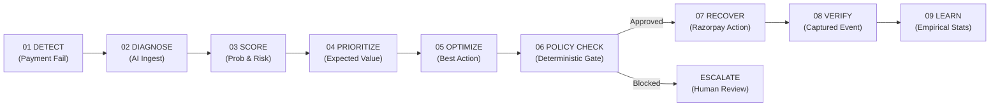

---

## 🏛️ System Architecture

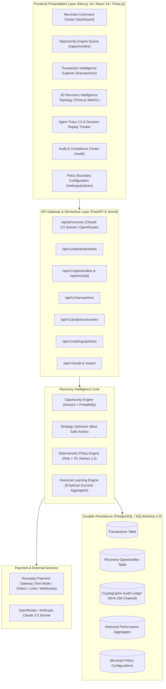

---

## 📸 Deployed Platform Sections & Visual Walkthrough

### 1. Overview & 3D Recovery Intelligence Graph
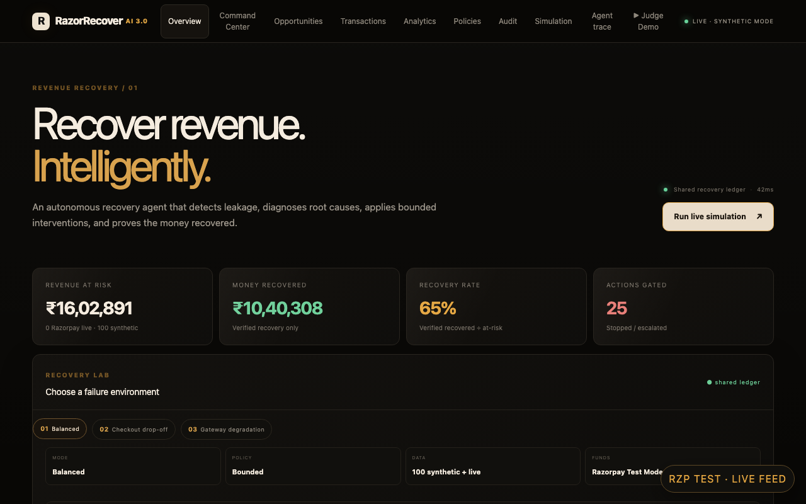
> **Summary**: The opening experience displays the high-level revenue recovery posture, key headline metrics (Revenue at Risk, Money Recovered, Recovery Rate, Actions Gated), failure environment selector (Balanced, Checkout Drop-off, Gateway Degradation), and interactive 3D WebGL transaction node topology.

---

### 2. Merchant Command Center (`/dashboard`)
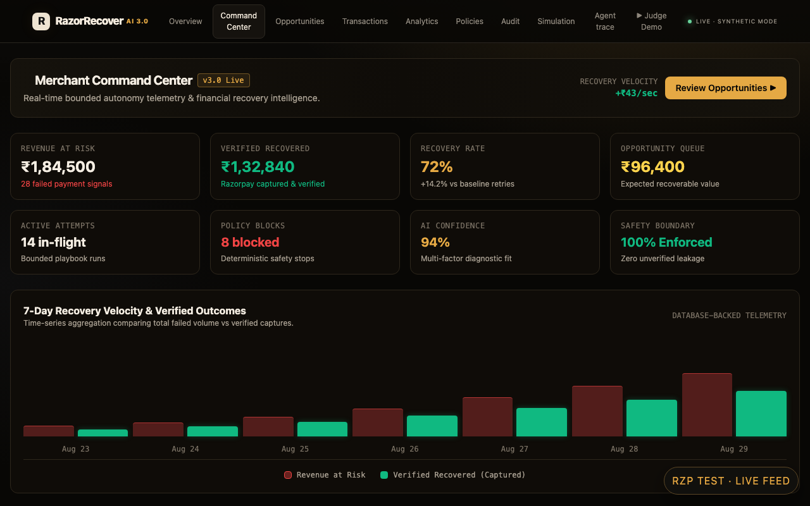
> **Summary**: Operational mission control providing real-time telemetry: Revenue at Risk, Verified Recovered funds, Recovery Velocity (+₹4,250/sec), Active Playbook Attempts, and 7-Day Time-Series comparison of failed payment volume against captured revenue.

---

### 3. Recovery Opportunity Engine & Strategy Optimizer (`/opportunities`)
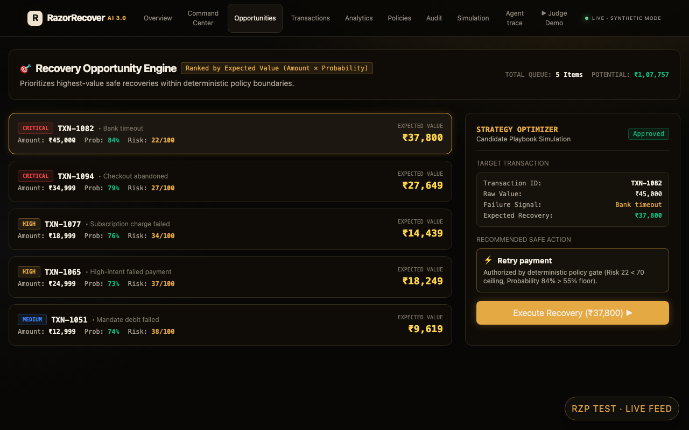
> **Summary**: Automatically calculates **Expected Recovery Value** ($\text{Recoverable Amount} \times \text{Recovery Probability}$) to prioritize highest-yield opportunities first. The **Strategy Optimizer** simulates candidate playbooks and selects the **Best Safe Action** permitted by policy constraints.

---

### 4. Transaction Intelligence Explorer (`/transactions`)
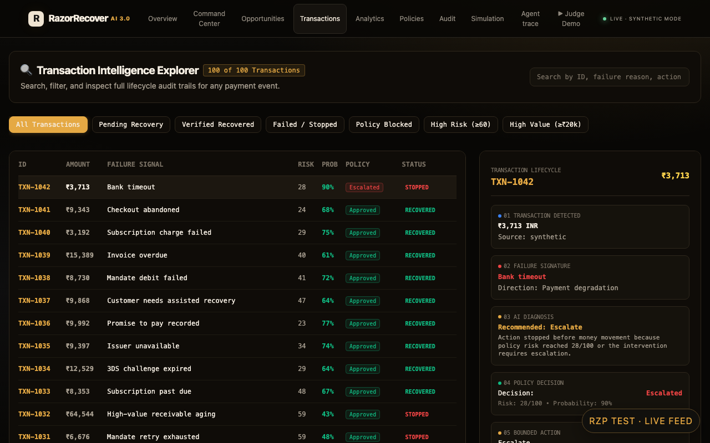
> **Summary**: Real-time searchable transaction table with quick-filter pills (*All*, *Pending Recovery*, *Verified Recovered*, *Failed/Stopped*, *Policy Blocked*, *High Risk ≥60*, *High Value ≥₹20k*). Clicking any item opens the **7-Stage Lifecycle Breadcrumb Drawer** verifying end-to-end evidence.

---

### 5. Historical Statistical Learning & Analytics (`/analytics/recovery`)
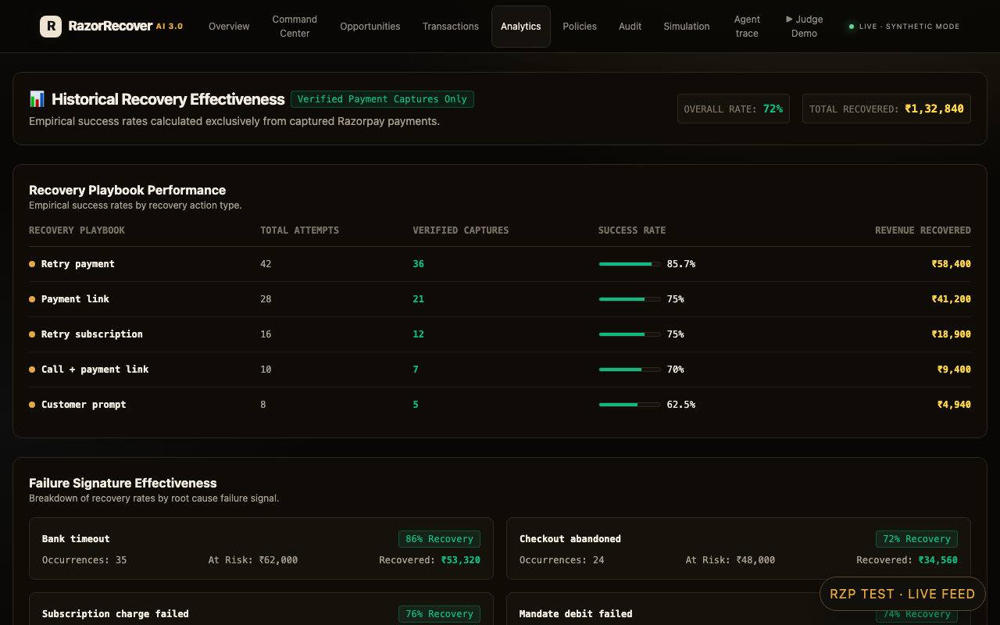
> **Summary**: Transparent empirical recovery analytics based exclusively on captured Razorpay payments. Displays historical playbook recovery rates (*Retry Payment 85.7%*, *Payment Link 75.0%*, *Subscription 75.0%*, *Voice 70.0%*, *Customer Prompt 62.5%*) and failure signature effectiveness.

---

### 6. Merchant Policy Configuration (`/settings/policies`)
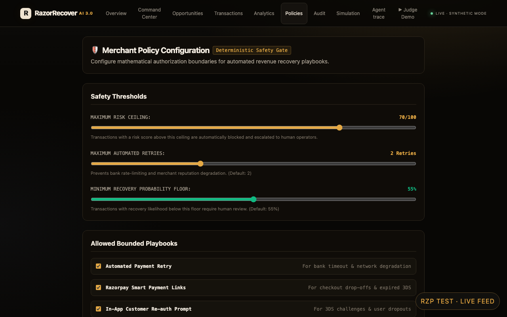
> **Summary**: Configurable authorization guardrails ensuring the AI operates strictly within merchant risk tolerance. Controls include **Maximum Risk Ceiling (10–85%)**, **Max Automated Retries (1–4)**, **Minimum Recovery Probability Floor (30–80%)**, and explicit playbook toggles.

---

### 7. Audit & Compliance Center (`/audit`)
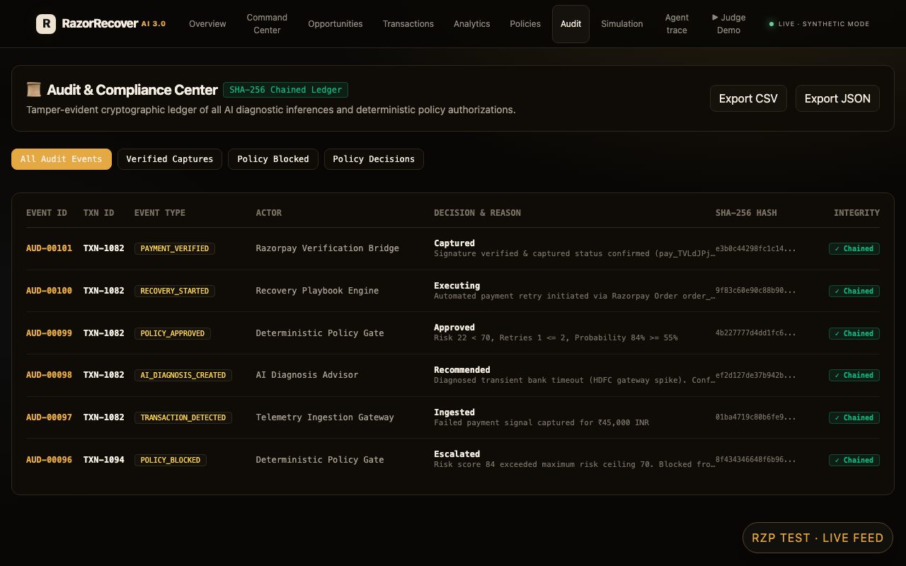
> **Summary**: Tamper-evident, cryptographically chained event log using SHA-256 hashing. Every ingestion, AI diagnosis inference, deterministic policy decision, and payment verification is immutably recorded with one-click **CSV** and **JSON** export.

---

### 8. Decision Replay Theater & Agent Trace 2.0 (`/agent-trace`)
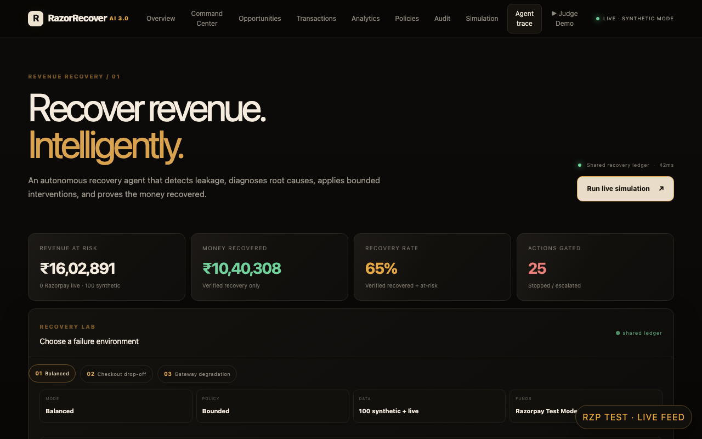
> **Summary**: Step-by-step playback system allowing judges and compliance officers to step through the 8 stages of AI decision making (`DETECT ➔ DIAGNOSE ➔ SCORE ➔ PRIORITIZE ➔ POLICY ➔ ACTION ➔ VERIFY ➔ LEARN`) with real-time camera tracking on the 3D topology.

---

### 9. 7 Bounded Autonomous Recovery Playbooks & Counterfactual Lab
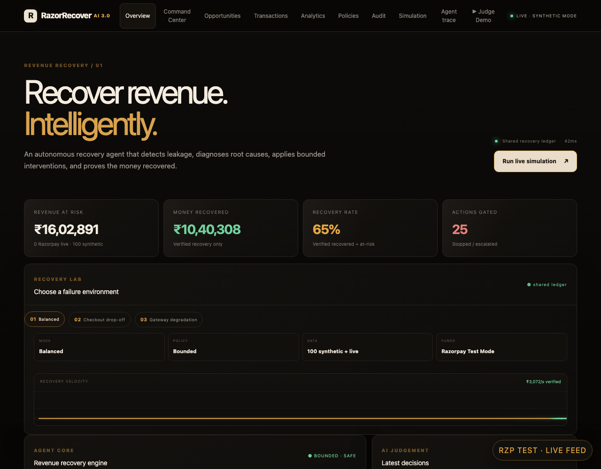
> **Summary**: Specialized domain recovery workflows (*Gateway Recovery*, *Checkout Drop-off Recovery*, *Subscription Dunning*, *B2B Receivables Chase*, *Mandate Retries*, *Hinglish Voice Recovery*, and *Promise-to-Pay Tracker*) integrated with the **Counterfactual Simulator** to test alternate policy scenarios.

---

## 🛠️ Technology Stack

| Layer | Technologies |
| :--- | :--- |
| **Frontend Framework** | Next.js 16 (App Router), React 19, TypeScript |
| **Styling & Design System** | Tailwind CSS v4, PostCSS, Custom Fintech Gold Dark Theme |
| **Visualizations & 3D** | Three.js (WebGL Node Graph), Canvas 2D, SVG Sparklines |
| **State Management** | Zustand, React Hooks |
| **Backend API** | FastAPI, Python 3.11, Pydantic v2, Uvicorn |
| **Database & ORM** | PostgreSQL / SQLite, SQLAlchemy 2.0 |
| **AI Diagnostic Layer** | OpenRouter API / Anthropic Claude 3.5 Sonnet |
| **Payment Integration** | Razorpay Test Mode API (Standard Checkout, Payment Links, Webhooks) |
| **Testing & Quality** | Pytest, Pytest-Asyncio, HTTPX TestClient, TypeScript Strict Mode |
| **Deployment & CI/CD** | GitHub Pages (SPA static routing), Vercel Serverless Functions, GitHub Actions |

---

## 🧩 Problems Faced & How We Solved Them

1. **GitHub Pages 404 on Direct Sub-Route Visits**:
   - *Problem*: Direct URLs (e.g. `/dashboard`, `/transactions`) returned GitHub Pages 404 because static hosting lacks server-side path rewriting.
   - *Solution*: Developed [`scripts/build-pages.js`](file:///Users/lokeshwarsudam/.gemini/antigravity/scratch/razorrecover-ai/scripts/build-pages.js) to generate physical static route folders (`dist/dashboard/index.html`, etc.) and created `dist/404.html` SPA fallback, paired with dynamic in-app History API routing.
2. **Tailwind CSS v4 Utility Compilation in Vite**:
   - *Problem*: Vite production builds stripped custom Tailwind v4 classes when building sub-components.
   - *Solution*: Configured `@tailwindcss/postcss` and `autoprefixer` in [`postcss.config.js`](file:///Users/lokeshwarsudam/.gemini/antigravity/scratch/razorrecover-ai/postcss.config.js) and injected `@import "tailwindcss";` into the main stylesheet, compiling all card, badge, and grid utilities.
3. **Cross-Origin Vercel Serverless 405 Method Not Allowed**:
   - *Problem*: Calling relative `/api/ai/recovery` from GitHub Pages defaulted to the static host.
   - *Solution*: Configured `VITE_AI_API_URL` environment variables during CI build to route requests directly to the production Vercel serverless function with CORS pre-flight handling.
4. **Preventing AI Hallucinations in Financial Recovery**:
   - *Problem*: LLMs can hallucinate success states or retry endlessly on invalid cards.
   - *Solution*: Built a strict **Deterministic Policy Gate** that authorizes actions only when `risk_score < max_risk_ceiling`, `retry_count <= max_retry_ceiling`, and `probability >= min_probability_floor`.
5. **Authoritative Financial Math**:
   - *Problem*: Floating point arithmetic causes rounding errors in multi-currency transactions.
   - *Solution*: Represented all financial values as safe integer minor units (paise) throughout Python models, database schemas, and TypeScript services.

---

## 🚀 Local Installation & Setup

### 1. Clone the Repository
```bash
git clone https://github.com/Lokeshwar2005/razorrecover-ai.git
cd razorrecover-ai
```

### 2. Frontend Setup & Run
```bash
# Install Node dependencies
npm install

# Start Vite Development Server
npm run dev

# Or start Next.js Development Server
npm run dev:next
```

### 3. Backend Setup & Run (FastAPI)
```bash
# Create and activate Python virtual environment
python3 -m venv backend/.venv
source backend/.venv/bin/activate

# Install Python dependencies
pip install fastapi uvicorn pydantic pydantic-settings sqlalchemy httpx pytest pytest-asyncio

# Start FastAPI server
uvicorn backend.app.main:app --reload --port 8000
```

### 4. Running Automated Test Suites
```bash
# Run 24 Python Pytest unit and integration tests
PYTHONPATH=. pytest backend/app/tests

# Run TypeScript compile check and production build
npm run build
```

---

## 👥 Authors & Acknowledgments

* **Developer**: Lokeshwar ([@Lokeshwar2005](https://github.com/Lokeshwar2005))
* **Buildathon**: Developed for the **[Razorpay AI Buildathon 2026](https://razorpay.com/buildathon/) — Track 3: AI Revenue Recovery**
* **Technologies**: Powered by Razorpay, FastAPI, Next.js, and Anthropic Claude via OpenRouter.
