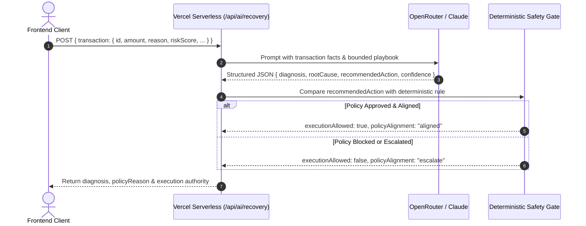
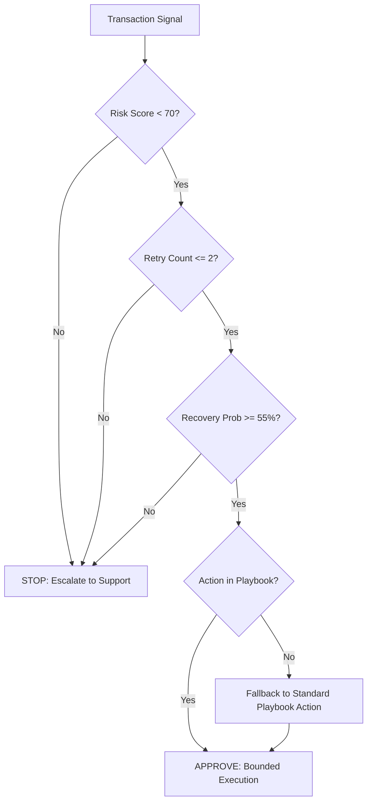
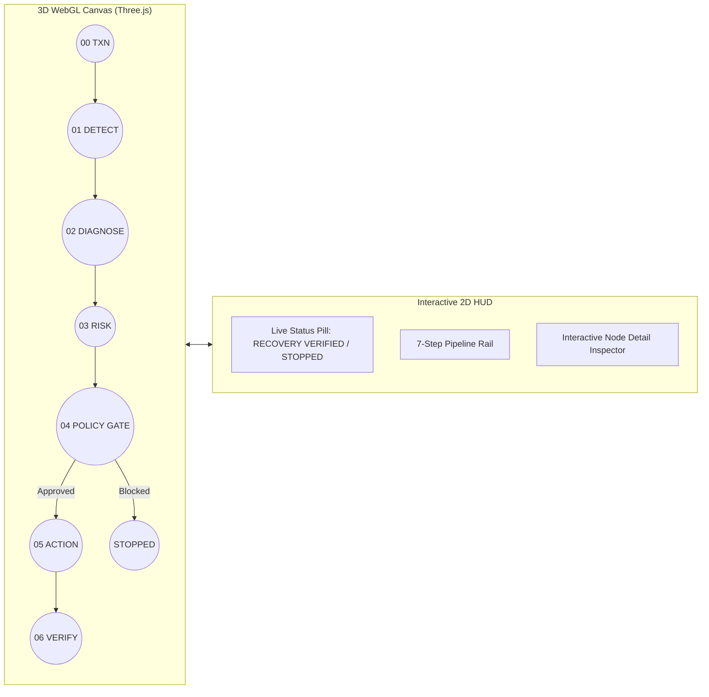
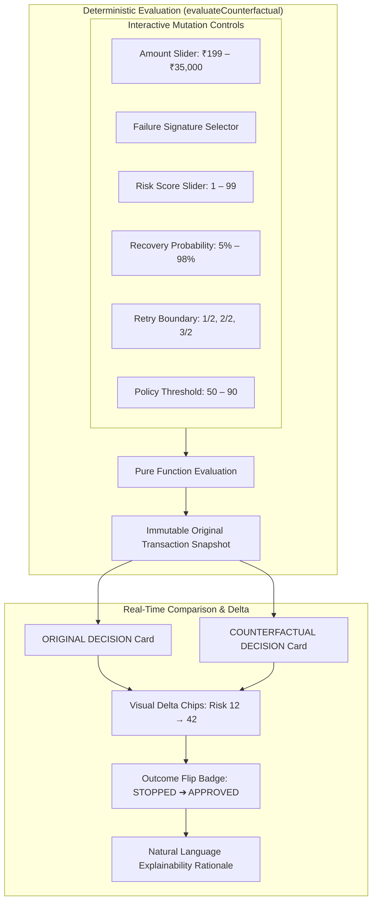
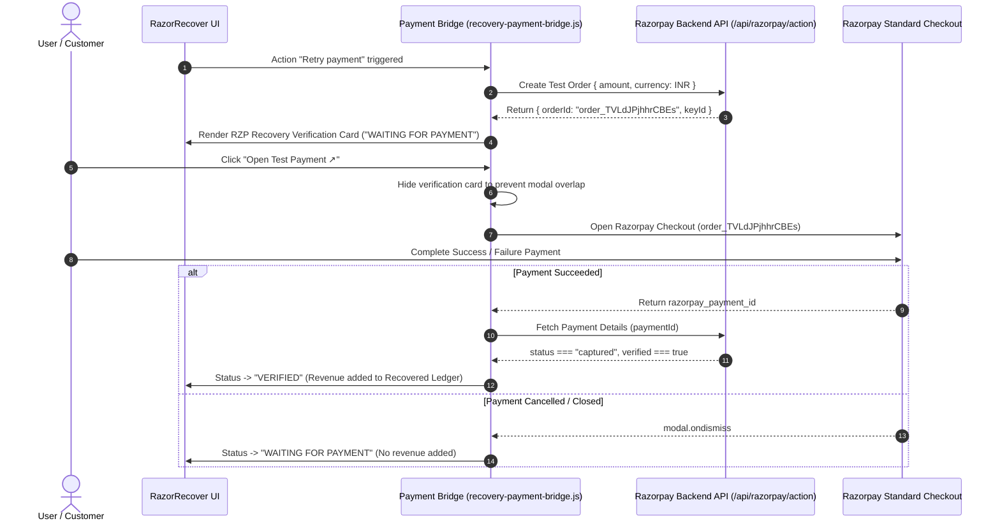

# ⚡ RazorRecover AI — Autonomous Explainable Revenue Recovery Agent

> **Built for [Razorpay AI Buildathon 2026](https://razorpay.com/buildathon/) — Track 3: AI Revenue Recovery**  
> *Autonomous AI agent detecting leakage, diagnosing failure signatures, enforcing deterministic policy boundaries, and verifying captured revenue.*

[](https://lokeshwar2005.github.io/razorrecover-ai/)
[](https://razorrecover-ai-teal.vercel.app/api/ai/recovery)
[](https://razorpay.com/buildathon/)
[](https://www.typescriptlang.org/)
[](https://threejs.org/)

---

## 📌 Table of Contents
1. [Executive Summary & Problem Statement](#-executive-summary--problem-statement)
2. [Razorpay AI Buildathon 2026: Track 3 Context](#-razorpay-ai-buildathon-2026-track-3-context)
3. [Full End-to-End System Architecture](#-full-end-to-end-system-architecture)
4. [Modular Architecture & Deep Dives](#-modular-architecture--deep-dives)
   - [A. Autonomous AI Diagnosis Layer (OpenRouter / Claude / MCP)](#a-autonomous-ai-diagnosis-layer-openrouter--claude--mcp)
   - [B. Deterministic Safety Gate & Policy Engine](#b-deterministic-safety-gate--policy-engine)
   - [C. Native Three.js 3D Recovery Intelligence Graph](#c-native-threejs-3d-recovery-intelligence-graph)
   - [D. Counterfactual Recovery Simulator (What-If Lab)](#d-counterfactual-recovery-simulator-what-if-lab)
   - [E. Razorpay Test Mode & Real-Time Checkout Verification Bridge](#e-razorpay-test-mode--real-time-checkout-verification-bridge)
   - [F. Decision Theater & Audit Trail Ledger](#f-decision-theater--audit-trail-ledger)
5. [Key Problems Faced & Engineering Solutions](#-key-problems-faced--engineering-solutions)
6. [Tech Stack & Dependencies](#-tech-stack--dependencies)
7. [Live Deployment Endpoints](#-live-deployment-endpoints)
8. [Local Development & Repository Cloning Guide](#-local-development--repository-cloning-guide)

---

## 🎯 Executive Summary & Problem Statement

In high-volume digital commerce, **10% to 25% of all transactions fail** due to transient gateway degradation, bank timeouts, 3DS challenge drop-offs, network interruptions, and user abandonment.

### The Problem:
* **Blind Retries Damage Merchant Reputation:** Naive retry scripts trigger bank rate-limits, incur network fees, and increase customer friction.
* **Manual Support is Slow:** Waiting hours for human agents to review payment logs results in permanently lost revenue.
* **Uncontrolled Generative AI is Risky in Fintech:** LLMs hallucinate numbers, misinterpret risk thresholds, and lack execution boundaries when dealing with money-moving operations.

### The RazorRecover Solution:
**RazorRecover AI** implements **Deterministic Bounded Autonomy**:
1. An **AI Diagnosis Agent** (powered by OpenRouter / Claude / Razorpay MCP) classifies failure signatures and recommends surgical interventions.
2. A **Zero-Hallucination Deterministic Policy Gate** strictly enforces mathematical boundaries (idempotency, max 2 retry limits, risk ceilings `< 70`, recovery probability `≥ 55%`).
3. **Razorpay Test-Mode Verification Bridge** ensures revenue is **never marked as recovered** until Razorpay confirms a captured payment status.
4. **Spatial 3D Intelligence & Counterfactual Simulation** provide complete transparency, explainability, and "what-if" scenario testing for operators and compliance teams.

```
   ┌────────────────┐      ┌─────────────────────────┐      ┌─────────────────────────┐
   │ Payment Signal │ ───► │  AI Diagnosis Advisor   │ ───► │ Deterministic Safety    │
   │    Captured    │      │ (OpenRouter / Claude)   │      │ (Policy Gating Engine)  │
   └────────────────┘      └─────────────────────────┘      └─────────────────────────┘
                                                                         │
                                                                         ▼
   ┌────────────────┐      ┌─────────────────────────┐      ┌─────────────────────────┐
   │ Revenue Counted│ ◄─── │ Razorpay Verification   │ ◄─── │ Bounded Recovery Action │
   │   in Ledger    │      │  (status === captured)  │      │(Payment Link / Retry /…)│
   └────────────────┘      └─────────────────────────┘      └─────────────────────────┘
```

---

## 🏆 Razorpay AI Buildathon 2026: Track 3 Context

The **[Razorpay AI Buildathon 2026](https://razorpay.com/buildathon/)** challenges engineers to rethink financial infrastructure through autonomous agentic systems.

* **Track:** **Track 3 — AI Revenue Recovery**
* **Core Mandate:** Design and build autonomous AI agents that detect, diagnose, and recover lost revenue from failed transactions, abandoned checkouts, and recurring subscription drop-offs while guaranteeing safety, explainability, and verifiable proof of recovery.
* **Project Name:** **RazorRecover AI**
* **Repository:** [https://github.com/Lokeshwar2005/razorrecover-ai](https://github.com/Lokeshwar2005/razorrecover-ai)

---

## 🏛️ Full End-to-End System Architecture

```mermaid
flowchart TD
    subgraph INGESTION["01. Event Stream & Ingestion Layer"]
        A1[Live Payment Stream / 100-Event Synthetic Engine] --> A2{Failure Signal Detected}
        A2 -->|Event Ingested| A3[Extract Transaction Context: ID, Amount, Error Code, Velocity]
    end

    subgraph AI_LAYER["02. Autonomous AI Diagnosis Layer"]
        A3 --> B1[API Gateway: /api/ai/recovery]
        B1 --> B2[OpenRouter / Claude LLM Inference]
        B2 --> B3[Extract Failure Signature & Root Cause]
        B3 --> B4[Recommend Bounded Action: Retry | Payment Link | Customer Prompt | Escalate]
    end

    subgraph POLICY_GATE["03. Deterministic Safety Gate (Source of Truth)"]
        B4 --> C1{Deterministic Policy Evaluation}
        C1 -->|Risk >= 70 OR Retries > 2| C2[POLICY BLOCKED · Escalate to Human]
        C1 -->|Risk < 70 & Prob >= 55%| C3[POLICY APPROVED · Execute Bounded Action]
        C2 --> C4[Immutable Exception Audit Event]
    end

    subgraph EXECUTION["04. Action Orchestration & Razorpay Bridge"]
        C3 --> D1[Razorpay Test Mode / MCP Tool Invocation]
        D1 --> D2[Create Test Order: order_TVLdJPjhhrCBEs]
        D2 --> D3[Customer Checkout Modal / Payment Link]
    end

    subgraph VERIFICATION["05. Real-Time Verification & Ledger"]
        D3 --> E1{Razorpay Webhook / Status Lookup}
        E1 -->|status !== captured| E2[WAITING FOR PAYMENT · Recovery Pending]
        E1 -->|status === captured| E3[VERIFIED · Revenue Captured]
        E3 --> E4[Update Verified Recovery Ledger & SHA-256 Audit Log]
    end

    subgraph VISUALIZATION["06. Explanatory & Spatial UI Suite"]
        E4 --> F1[Native Three.js 3D Recovery Intelligence Graph]
        E4 --> F2[Counterfactual Recovery Simulator Lab]
        E4 --> F3[Decision Theater Modal]
        E4 --> F4[AI Recovery Advisor HUD]
    end

    style INGESTION fill:#111,stroke:#3b3325,stroke-width:1px,color:#fff
    style AI_LAYER fill:#14120e,stroke:#b99552,stroke-width:1px,color:#fff
    style POLICY_GATE fill:#1a140d,stroke:#e4a641,stroke-width:1px,color:#fff
    style EXECUTION fill:#111a14,stroke:#70d09b,stroke-width:1px,color:#fff
    style VERIFICATION fill:#0d1a12,stroke:#8ee3ae,stroke-width:1px,color:#fff
    style VISUALIZATION fill:#15120e,stroke:#554a3a,stroke-width:1px,color:#fff
```

---

## 🧩 Modular Architecture & Deep Dives

### A. Autonomous AI Diagnosis Layer (OpenRouter / Claude / MCP)

The AI layer diagnoses failure context without holding money-moving authorization.



* **Resilient JSON Parser:** Eliminates 502 gateway errors by gracefully falling back to deterministic transaction facts if LLM output contains raw markdown.
* **Zero Secret Leakage:** OpenRouter API keys and Razorpay API secrets remain strictly inside the serverless runtime.

---

### B. Deterministic Safety Gate & Policy Engine

Fintech requires absolute mathematical guarantees. LLMs cannot override safety rules.



#### Policy Rules Enforced:
1. **Idempotency Guarantee:** Duplicate order IDs are deduplicated before reaching gateways.
2. **Hard Retry Ceiling:** Max 2 automated retries per transaction.
3. **Risk Boundary:** Any transaction with a Risk Score `≥ 70` is immediately blocked.
4. **Autonomous Action Playbook:** Limited strictly to:
   - `Retry payment` (Network degradation, Bank timeout)
   - `Payment link` (Checkout abandoned, Insufficient balance)
   - `Customer prompt` (3DS challenge expired, Authentication failed)
   - `Escalate` (Velocity risk, Stolen instrument flags)

---

### C. Native Three.js 3D Recovery Intelligence Graph

A spatial 3D visualization rendering the real-time movement of transactions through the 7 recovery stages.

```
 [00 Txn Ingest] ──► [01 Detect] ──► [02 Diagnose] ──► [03 Risk] ──► [04 Policy Gate] ──► [05 Action] ──► [06 Verify]
```



* **GPU Lifecycle Management:** Clean scene disposal on unmount, single WebGL canvas reuse, zero per-frame garbage collector allocations.
* **Adaptive Flow Conduits:** Traveling particle packets represent transaction data moving across curved bezier conduits.
* **Policy Reactivity:** If an action is blocked at `04 POLICY GATE`, energy conduits immediately halt, illuminating the gate red while downstream action nodes stay inactive.

---

### D. Counterfactual Recovery Simulator (What-If Lab)

Allows operators and auditors to test: *"What would happen if the failure conditions changed?"*



---

### E. Razorpay Test Mode & Real-Time Checkout Verification Bridge

No revenue is marked as recovered based on an AI prediction alone. Revenue enters the ledger **only when Razorpay confirms a captured payment**.



---

### F. Decision Theater & Audit Trail Ledger

* **Decision Theater Modal:** Accessible deep-dive inspect tool detailing signal ingestion, classification latency, model confidence, and policy rules.
* **Cryptographic Event Hash:** Every recovery decision outputs a deterministic SHA-256 audit fingerprint (`hash: 9f2a…e81c`) ensuring compliance traceability.
* **100-Event Synthetic Streams:** Includes 3 failure environments:
  1. *Balanced:* Mixed failure distribution with standard gating.
  2. *Checkout Drop-off:* High abandonment volume with payment link triggers.
  3. *Gateway Degradation:* Transient bank downtimes with retry-first policies.

---

## 🛠️ Key Problems Faced & Engineering Solutions

| # | Challenge | Root Cause | Engineering Solution |
|---|---|---|---|
| **1** | **Fintech Safety vs Generative AI** | LLMs can hallucinate amounts, actions, or override risk thresholds. | Engineered a **Two-Tier Architecture**: AI layer provides advisory recommendations, while a **pure deterministic engine** holds sole execution authority. |
| **2** | **405 Method Not Allowed on GitHub Pages** | GitHub Pages is a static file host that rejects HTTP `POST` requests to relative `/api/...` routes. | Updated GitHub Actions workflow to compile with `VITE_AI_API_URL` pointing directly to the live Vercel Serverless Function, enabling secure cross-origin API calls with CORS headers. |
| **3** | **Production Blank Page (Vercel)** | `vite.config.ts` had a hardcoded `base: '/razorrecover-ai/'` for GitHub Pages, causing 404s on Vercel's root domain. | Configured a **dynamic base path** in Vite: `process.env.VITE_BASE_PATH \|\| (process.env.GITHUB_ACTIONS ? '/razorrecover-ai/' : '/')`. |
| **4** | **Vercel Build Error (`recovery.js` pattern)** | Stale `vercel.json` referenced `api/ai/recovery.js` after rewriting the backend in TypeScript. | Cleaned `vercel.json` to `{ "framework": "vite" }`, allowing Vercel's builder to natively detect and compile `api/ai/recovery.ts` with zero pattern mismatches. |
| **5** | **Checkout Popup Overlap & Missing Close** | The RZP Verification card had maximum z-index (`2147483647`) and no dismiss button, obstructing Razorpay's checkout modal. | Added an accessible `✕` close button, keyboard <kbd>Esc</kbd> support, and automated hiding/restoring during checkout modal lifecycle. |
| **6** | **WebGL Performance & Memory Leaks** | Continuous 3D canvas recreation during state updates causes GPU context loss and frame drops. | Built a modular singleton scene manager with `IntersectionObserver` auto-pause, GPU geometry/material disposal, and zero per-frame allocations. |

---

## 💻 Tech Stack & Dependencies

* **Frontend Framework:** React 19, TypeScript (Strict Mode)
* **Build Tooling:** Vite 8, Rolldown bundler, GitHub Actions CI/CD
* **3D Spatial Visualization:** Three.js (Native WebGL)
* **State & Flow Management:** Zustand & React Hooks
* **Styling:** Custom Vanilla CSS (Dark Fintech Aesthetics, Glassmorphism, Responsive Grid)
* **Backend Runtime:** Vercel Serverless Functions (Node.js / Edge Runtime)
* **AI & LLM Gateway:** OpenRouter API (`openrouter/free`, Claude Sonnet, Anthropic)
* **Payment Infrastructure:** Razorpay SDK (Standard Checkout, Orders API, Payment Verification)

---

## 🌐 Live Deployment Endpoints

* **Production Frontend (GitHub Pages):**  
  [https://lokeshwar2005.github.io/razorrecover-ai/](https://lokeshwar2005.github.io/razorrecover-ai/)
* **Production Serverless Function (Vercel API):**  
  [https://razorrecover-ai-teal.vercel.app/api/ai/recovery](https://razorrecover-ai-teal.vercel.app/api/ai/recovery)
* **GitHub Repository:**  
  [https://github.com/Lokeshwar2005/razorrecover-ai](https://github.com/Lokeshwar2005/razorrecover-ai)

---

## 🚀 Local Development & Repository Cloning Guide

### 1. Clone the Repository
```bash
git clone https://github.com/Lokeshwar2005/razorrecover-ai.git
cd razorrecover-ai
```

### 2. Install Dependencies
```bash
npm install
```

### 3. Configure Environment Variables
Copy the `.env.example` file to `.env.local`:
```bash
cp .env.example .env.local
```

Configure the following variables in `.env.local` or your Vercel Dashboard:
```bash
# Server-Side AI Inference (Vercel Serverless)
OPENROUTER_API_KEY=your_openrouter_api_key_here
OPENROUTER_MODEL=openrouter/free

# Razorpay Test Mode Credentials
RAZORPAY_KEY_ID=your_razorpay_test_key_id
RAZORPAY_KEY_SECRET=your_razorpay_test_secret

# Frontend API Destination (Optional, defaults to /api/ai/recovery or Vercel URL)
VITE_AI_API_URL=https://razorrecover-ai-teal.vercel.app/api/ai/recovery
```

### 4. Run Locally
```bash
npm run dev
```
Open [http://localhost:5173](http://localhost:5173) in your browser.

### 5. Build & Typecheck
```bash
npm run build
```
Executes TypeScript type checking (`tsc --noEmit`) and compiles the production bundle via Vite.

---

## 🔒 Security & Safe Harbour Note
* RazorRecover AI runs exclusively against **synthetic payment data** and **Razorpay Test Mode**.
* No real customer cards, bank accounts, or real funds are ever charged or moved.
* API secrets and keys are never bundled in client-side code.

---

<div align="center">
  <sub>Built with ❤️ for the <strong>Razorpay AI Buildathon 2026</strong> · Track 3: AI Revenue Recovery</sub>
</div>
